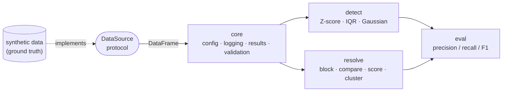

# dqkit — modular data quality at scale

A small, **typed, Spark-efficient** toolkit for two of the harder problems in data quality:

- **Anomaly detection** — flag statistically unusual records (Z-score, IQR, per-group Gaussian).
- **Entity resolution** — find records that refer to the same real-world entity (blocking → comparison → scoring → clustering).

Both capabilities sit on one shared `core` foundation — typed config, structured logging, validation, immutable result types — and plug in through narrow interfaces, so a new detector or matcher is added **without touching the core**.

> **Why this repo exists.** It's a portfolio piece demonstrating the data-quality engineering patterns I build with day to day. My production work in this space is confidential, so this is an original, clean-room implementation on public/synthetic data: the same architecture and PySpark techniques, none of the proprietary code.

## Design principles

- **Dependency inversion.** Ingestion hides behind a `DataSource` protocol; detection behind a `Detector` protocol. Swap synthetic data for a real warehouse, or add a detector, and callers don't change.
- **Open/closed.** Detectors self-register; a new method is a new file, never an edit to a growing `if/elif`.
- **Layered API.** A two-function facade (`detect_anomalies`, `resolve_entities`) handles the common case in one call, while the protocols, detectors, scorers, and pipelines underneath stay directly composable for full control.
- **Typed boundaries.** `pydantic` config at the edges, frozen dataclasses for every result — invalid states are hard to represent.
- **Spark efficiency, on purpose.** Broadcast joins for blocking, partition-aware grouped statistics, native column expressions over Python UDFs, no `.count()` in transformation loops, lazy evaluation kept lazy. Deliberate choices are commented where they matter (e.g. why a broadcast cross-join beats a global `Window`).
- **Provably correct.** Synthetic data ships with ground-truth labels, so the toolkit reports real precision/recall/F1 — and the suite holds 100% coverage.

## Architecture



## Layout

```
src/dqkit/
├── core/        # typed foundation — depends on nothing in the toolkit
│   ├── config.py        # pydantic settings (typed boundaries)
│   ├── logging.py       # structured, single-config logger
│   ├── results.py       # frozen result dataclasses
│   ├── source.py        # DataSource protocol (DIP)
│   └── validation.py    # DataFrame precondition guards
├── detect/      # anomaly detection
│   ├── base.py          # Detector protocol + registry (open/closed)
│   ├── zscore.py        # global z-score (broadcast cross-join)
│   ├── iqr.py           # Tukey-fence IQR detector
│   ├── gaussian.py      # per-group z-score (Window.partitionBy)
│   └── pipeline.py      # compose detectors over a column
├── resolve/     # entity resolution
│   ├── block.py         # blocking via self-join on a shared key
│   ├── compare.py       # field comparators (native, no UDFs)
│   ├── score.py         # weighted match score + decision
│   ├── cluster.py       # union-find connected components
│   └── pipeline.py      # block -> compare -> score -> cluster
├── sources/
│   └── synthetic.py     # transactions + customers w/ planted ground truth
├── eval/
│   └── metrics.py       # precision / recall / F1 vs ground truth
└── demo.py              # runnable end-to-end demonstration
```

## Quickstart

```python
from pyspark.sql import SparkSession

from dqkit import detect_anomalies, resolve_entities
from dqkit.sources import SyntheticCustomers, SyntheticTransactions

spark = SparkSession.builder.getOrCreate()

# Anomaly detection — one call; choose the method by name:
txns = SyntheticTransactions().load(spark)
report = detect_anomalies(txns, "amount", method="gaussian", group_col="customer_id")
print(f"flagged {report.n_flagged} rows")

# Entity resolution — one call:
customers = SyntheticCustomers().load(spark)
result = resolve_entities(customers)
print(f"{result.n_records} records -> {result.n_entities} entities")

# Need finer control? These are a thin facade — drop down to the building
# blocks (get_detector(...), GaussianDetector(...), ResolutionPipeline(...))
# for full configurability.
```

```bash
make install   # editable install + dev deps
make test      # pytest with coverage (fail_under = 100)
make lint      # ruff lint + format check
make demo      # run the end-to-end demo with metrics
```

## Results

`make demo` generates labelled synthetic data and scores each capability against the planted ground truth (reproducible from the seeds):

| Capability | Precision | Recall | F1 |
| --- | --- | --- | --- |
| Anomaly — global z-score | 1.00 | 0.76 | 0.86 |
| Anomaly — per-group Gaussian | 0.95 | 0.95 | **0.95** |
| Entity resolution (pairwise) | 1.00 | 0.81 | **0.90** |

The per-group Gaussian beats the global z-score because customer spend is heterogeneous: one global threshold can't separate a big spender's routine purchase from a small spender's genuine anomaly. Resolution holds perfect precision because the weighting guarantees that agreement on non-identifying fields alone cannot clear the match threshold.

## Status / roadmap

- [x] `core` foundation — config, logging, results, validation, `DataSource` protocol
- [x] `detect` — `Detector` protocol + registry; z-score, IQR, per-group Gaussian, pipeline
- [x] `resolve` — blocking, comparison, scoring, connected-component clustering
- [x] `eval` + `demo` — label & pairwise metrics, runnable end-to-end demo
- [x] `sources.synthetic` — transactions + customers with planted ground truth
- [x] tests at 100% coverage + CI across Python 3.10–3.12

## License

MIT — see [LICENSE](LICENSE).
